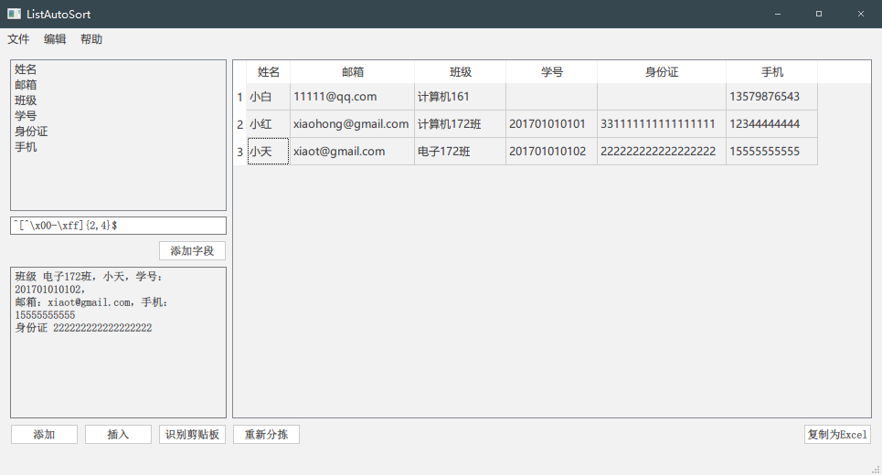

列表信息分拣
===

将多条散乱的规则信息自动分类成表格。

例如：QQ 发过来的请假消息，要是手动复制，几百个人的话岂不是累死？

于是自己做了一个自动分类提取的工具。

例如以下内容：

```
小白 计算机161 11111@qq.com 13579876543
```

```
计算机172班
小红
201701010101
xiaohong@gmail.com
12344444444
331111111111111111
```

```
班级 电子172班，小天，学号：201701010102，
邮箱：xiaot@gmail.com，手机：15555555555
身份证 222222222222222222
```

都是可以正常识别的，结果如下：



然后可以导出到Excel，用Excel的功能进行统计，万事大吉，跑去休息休息！

---

## 识别算法

1. 使用正则分割
2. 根据字段名字判断
3. 根据正则表达式循环判断能够确定的（唯一）
4. （不唯一但满足正则的按顺序放）

```C++
class TableAITool
{
	struct IndexConnection
	{
		int field; // 字段索引
		int info;  // 信息索引
		int type;

		IndexConnection(int f, int i) : field(f), info(i) { }
		IndexConnection(int f, int i, int t) : field(f), info(i), type(t) { }
	};

public:
	TableAITool(QString m, QList<FieldItem>f);

	QStringList getResult();
	QString getResultString();

protected:
	void start();
	void init();
	void filter();
	void compareFields();
	void compareRegExp();
	void compareMissing();

private:
	bool canMatch(QString str, QString reg);

protected:
	QString mixture;        // 原文本（过滤后的）
	QList<FieldItem>fields; // 字段列表，名字+表达式
	QStringList infos;      // 分割后的每条信息
	QList<bool>captured;    // 是否已经匹配了
	QStringList result;     // 返回结果
};
```

```C++
void TableAITool::start()
{
	init();
	filter();

	compareFields();
	compareRegExp();
	compareMissing();
}

/**
 * 初始化变量
 */
void TableAITool::init()
{
	for (int i = 0; i < fields.size(); i++)
	{
		result << "";          // 先初始化成空的
		captured.append(false);
	}
}

/**
 * 替换文本中的 逗号、冒号、顿号
 */
void TableAITool::filter()
{
	mixture = mixture.replace(QRegExp(QStringLiteral("[:,：，。、\\s]+")), "\n");
	//QMessageBox::information(NULL, "replace", mixture);
	qDebug() << QStringLiteral("替换后的文本：") << mixture;
	infos = mixture.split("\n", QString::SplitBehavior::SkipEmptyParts);
	qDebug() << QStringLiteral("分割后的长度：") << infos.size();
}

/**
 * 比较：字段名一模一样的
 */
void TableAITool::compareFields()
{
	QList<int>same; // same 与 infos 等长
	for (int i = 0; i < infos.size(); i++)
		same << -1;

	// 比较每个字段和每条信息的字符串
	for (int i = 0; i < fields.size(); i++) // 遍历字段
	{
		for (int j = 0; j < infos.size(); j++) // 遍历信息
		{
			if (fields[i].getName() == infos[j])
			{
				same[j] = i;
			}
		}
	}

	// 这一条一样，且下一条不一样（避免连续字段错乱）
	for (int i = 0; i < infos.size()-1; i++)
	{
		// 这个字段匹配了，加入 i+1，删除 i 以及 i+1
		if (same[i] > -1 && same[i + 1] == -1)
		{
			int index = same[i]; // 对应字段的索引
			qDebug() << QStringLiteral("匹配：") << fields[index].getName() << "  " << infos[i + 1];
			if (captured[index]) // 重复匹配了……
				continue;
			result[index] = infos[i + 1];
			captured[index] = true;
		}
	}

	// 删除已经匹配的（倒序删除）
	for (int i = infos.size() - 1; i >= 0; i--)
	{
		// 删除这两条
		if (same[i] > -1 && same[i + 1] == -1)
		{
			infos.removeAt(i + 1);
			infos.removeAt(i);
		}
	}
}

/**
 * 比较：正则表达式匹配的
 */
void TableAITool::compareRegExp()
{
	QList<IndexConnection>ics;

	// 检测所有单个匹配的
	bool find = true;
	int index = 0;
	while (find)
	{
		if (index >= fields.size())
			break;;
		if (captured[index] || fields[index].getPattern().isEmpty()) // 已经匹配过的或正则是空的
		{
			index++;
			continue;
		}

		//寻找当前正则所有能匹配的信息，以及第一个匹配的位置
		int count = 0, place = -1;
		for (int i = 0; i < infos.size(); i++)
			if (canMatch(infos[i], fields[index].getPattern()))
			{
				count++;
				if (place == -1)
					place = i;
			}

		// 有且仅有这一个能匹配
		if (count == 1)
		{
			qDebug() << QStringLiteral("正则匹配到：") << fields[index].getName() << "    " << infos[place] << "    " << fields[index].getPattern();
			result[index] = infos[place];
			infos.removeAt(place);  // 匹配后删除
			captured[index] = true; // 这个字段匹配了
			index = 0;              // 从头开始计算
		}
		else
		{
			index++;                // 没有匹配，继续尝试下一个
		}
	}
}

/*
 * 比较：剩余没有匹配的
 * 按顺序依次填充上去
 */
void TableAITool::compareMissing()
{

}

```

